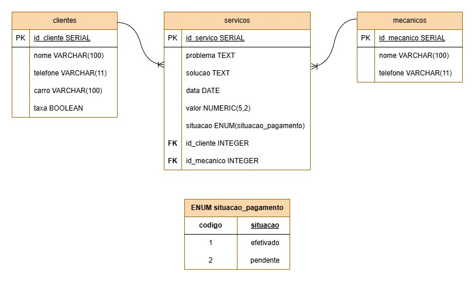

# Osvaldo Motors

Sistema desenvolvido para **Osvaldo Motors**, com o objetivo de auxiliar no gerenciamento dos serviços realizados pela oficina. A plataforma permite registrar veículos, proprietários, problemas identificados, serviços realizados e valores cobrados, além de controlar os pagamentos dos clientes e aplicar automaticamente as regras de cobrança definidas pela oficina.

---

## MER (Modelo Entidade-Relacionamento)

### Entidades e Atributos

#### clientes
- id_cliente SERIAL PRIMARY KEY
- nome VARCHAR(100)
- telefone VARCHAR(11)
- carro VARCHAR(100)
- taxa BOOLEAN

#### servicos
- id_servico SERIAL PRIMARY KEY
- problema TEXT
- solucao TEXT
- data DATE
- valor NUMERIC(5,2)
- situacao ENUM(situacao_pagamento)
- id_cliente INTEGER FOREIGN KEY
- id_mecanico INTEGER FOREIGN KEY

#### mecanicos
- id_mecanico SERIAL PRIMARY KEY
- modelo VARCHAR(100)
- taxa BOOLEAN

### Relacionamentos
- 1 cliente compra N servicos
- 1 mecanico realiza N servicos

---

## DER (Diagrama Entidade-Relacionamento)

